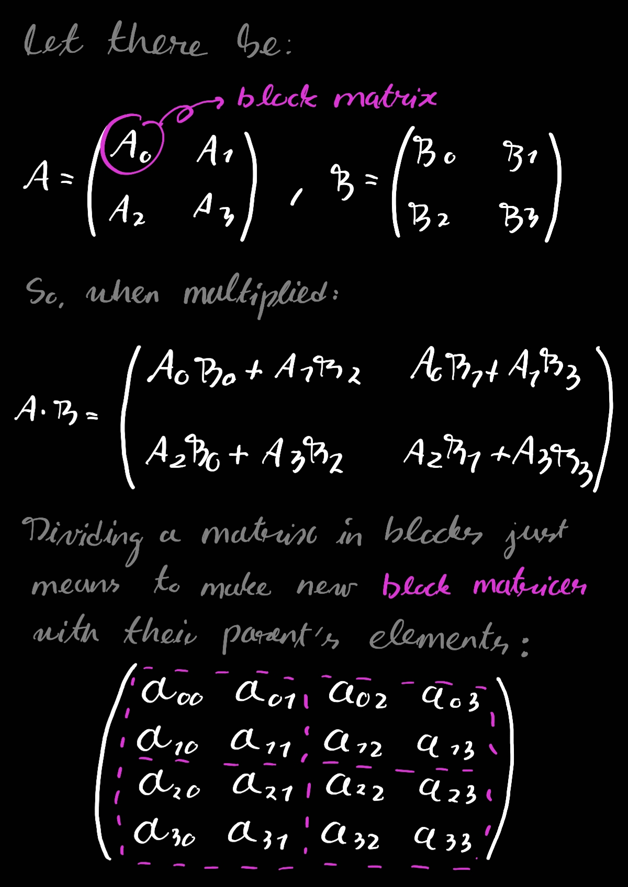

# Parallel matrix multiplication

Matrix multiplication is one of the most important operations in linear algebra so its optimization is of great interest. A naive implementation of a matrix multiplication between two square matrices of size *n* has a complexity of *O(n^3)*, which can be really problematic in machine learning or big data applications, for example.

GPUs are designed for massively parallelizing simple computations, which seems great for multiplying matrices as the only operations involved are products and sums of numbers. But how can be extract all these operations in a organized way so we can send to the GPU for it to do the hard work?

## Divide and conquer

From now on let's suppose that we want to multiply two square matrices which sizes are powers of two, in the form of *2^n x 2^n*. This is for the sake of simplicity as we really don't want to reinvent the wheel and create a general solution to this problem, but just practice Metal with a non-trivial problem.

A matrix can be divided into multiple blocks, and operations between matrices can be made in terms of these. Let's divide our matrices into 4 square blocks:

A matrix can be divided multiple times until only 2x2 blocks remain (this is why a size of *2^n* was selected), which are the easiest to sum and multiply. This means that our problem can be divided in simpler sub-problems in a recursive way!

## Now in Metal

Work can be submitted to the GPU by a **command queue**, which hold **command buffers** each containing specific instructions that we want the device to execute. Command buffers can be written on using **command encoders**.

So our workflow should be:

1. Recursively divide our matrices into 2x2 blocks.
2. Organize all the products and sums needed to multiply these blocks.
3. Wrap these with an encoder and add them to a command buffer.
4. Commit the buffer, retrieve the results.
5. Build a final matrix from the resulting 2x2 blocks.
